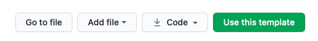

# Python Template

A Python project template to save you time and energy.

Python projects take a long time to setup with all the various files, the virtual environment, and keeping things uniform across projects. With this Python template, you can quickly setup boilerplate code and miscellaneous items for your Python project saving you time and energy so you can get back to coding. 

## Install

Click the `Use this template` button at the top of this project's GitHub page, it looks like this:

## Usage

**Easy text replacements**

1. Replace all instances of `python_project` with the name of your project
1. Replace all instances of `Python Template` with the name of your project
1. Replace all instances of `PROJECT_NAME` with the name of your project
1. Replace all instances of `USERNAME` with the name of the author/owner as it appears on GitHub

**File configuration**

1. Configure the `setup.py` file
1. Configure the `Makefile` targets
1. Update the name in the `LICENSE`
1. Configure the `.github/workflows/build.yml` file
1. Update the `CHANGELOG`
1. Replace the showcase image in `/assets` and remove all other unneeded assets
1. Change the data in `.github/FUNDING.yml`
1. Rename other files/folders as needed and configure their content
1. Delete this `README` and rename `README_project.md` to `README.md`

**GitHub configuration**

1. Add a `PYPI_API_TOKEN` GitHub secret to your project so that automated releasing can occur from GitHub Actions to PyPI and uncomment the final step on the `release` job in `.github/workflows/release.yml`

## Attribution

* Watch [the video](https://youtu.be/ZMfcl3CnRhA) where I built this template.
